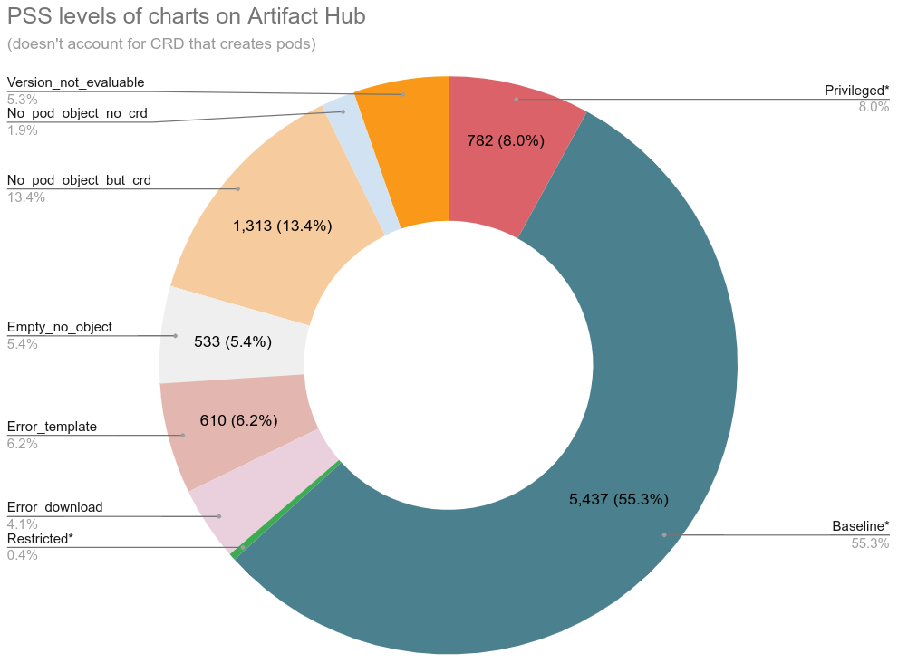

# Pod Security Admission command line checker

[](https://github.com/vicenteherrera/psa-checker/actions/workflows/go-build.yaml)
[](https://github.com/vicenteherrera/psa-checker/actions/workflows/go-build.yaml)
[](https://github.com/vicenteherrera/psa-checker/actions/workflows/go-build.yaml)
[](https://goreportcard.com/report/github.com/vicenteherrera/psa-checker)
[](https://pkg.go.dev/github.com/vicenteherrera/psa-checker)
[](/LICENSE.txt)

[Overview](#overview) | [Motivation](#motivation) |
[Warning](#warning) | [How it works](#how-it-works) |
[Examples](#examples) | [Installation](#Installation) |
[Build](#build-the-binary) | [Artifact Hub](#artifact-hub-helm-charts)

## Overview

Command line tool to statically checks for _Pod Security Standards_ levels on Kubernetes YAML manifests, including from local files or Helm charts, those processed in CI/CD pipelines, or running pods.

GitHub Repo: [github.com/vicenteherrera/psa-checker](https://github.com/vicenteherrera/psa-checker)  
Web: [vicenteherrera.com/psa-checker](https://vicenteherrera.com/psa-checker)  
Installation to `$GOPATH/bin`:  
```bash
curl -fsSL https://raw.githubusercontent.com/vicenteherrera/psa-checker/main/install/install.sh | INSTALL_DIR="$(go env GOPATH)/bin" bash
```  


## Motivation

The Pod Security Admission included in Kubernetes 1.23 as beta enabled by default, checks pod's specs against [Pod Security Standards (PSS)](https://kubernetes.io/docs/concepts/security/pod-security-standards/) of _privileged_, _baseline_ or _restricted_. It works perfectly fine doing its job to prevent pods non compliant with a namespace's PSS to run.

But it gives no warning when you deploy objects that creates pods but are not pods themselves: **Deployment, Daemonset, Replicaset, StatefulSet, Job or Cronjob**, unless you wait for them to create pods and watch logs.

There is also no tool to statically check files for those levels, without having a full cluster deployed... until now.

Pod Security Standards are the replacement for the deprecated Pod Security Policies (PSP) that are removed on Kubernetes v1.25.

## Warning

This project is in _alpha_ stage, how it handles input and output can change in several ways in the near future.

## How it works

This projects uses the [Pod Security Admission](https://github.com/kubernetes/pod-security-admission) library from Kubernetes repository to build a command line CLI you can use to check Kubernetes YAML manifests locally or in a pipeline.

The input manifest file can have any number of Kubernetes objects, all will be evaluated, and those that the check doesn't apply will be skipped.

This tool can't check into CRD that in turn creates pods, like when Tekton creates a pod to execute each step in a pipeline.


## Examples

### Checking YAML manifest files

```console
$ # Check if a kubernetes file is compliant with PSS level "restricted"
$ psa-checker --file deployment.yaml --level restricted
Deployment nginx-deployment
  PSS level restricted
    Check 8 failed: allowPrivilegeEscalation != false
      container "nginx" must set securityContext.allowPrivilegeEscalation=false
    Check 9 failed: unrestricted capabilities
      container "nginx" must set securityContext.capabilities.drop=["ALL"]
    Check 11 failed: runAsNonRoot != true
      pod or container "nginx" must set securityContext.runAsNonRoot=true
    Check 13 failed: seccompProfile
      pod or container "nginx" must set securityContext.seccompProfile.type to "RuntimeDefault" or "Localhost"
```

You can specify restricted or baseline level (specifying privileged, as it would allow everything, is not useful)

```bash
# Check if a kubernetes file is compliant with PSS level "restricted"
psa-checker -f deployment.yaml --level restricted

# Check if a kubernetes file is compliant with PSS level "baseline"
psa-checker -f deployment.yaml --level baseline
```

See additional help and parameter information with:
```bash
psa-checker --help
```

### Checking a Helm chart

You can run `template` for a Helm chart with your specific parameters, and feed the renderd YAML to this tool to have an evaluation for the whole chart. This is useful to run locally from your computer without any cluster, or on a pipeline before deploying anything, and let it fail if the desired PSS level is breached.

```bash
# You can process a Helm chart from stdin
helm repo add prometheus-community https://prometheus-community.github.io/helm-charts
helm repo update
helm template prometheus-community/kube-prometheus-stack | psa-checker --level restricted -f -
```

Sometimes charts have parts that are only rendered when a specific API is detected on the connected Kubernetes cluster. If you have a connection to a cluster, you can render the exact version of manifests that would be deployed, and test them, with something like this:

```bash
# Render as dry-run, and pipe output to psa-checker
# The first part is parameters used, we need to remove everything until "HOOKS:" appear
# We need to remove the word "MANIFESTS:", and we need to cut everything after "NOTES:"
helm install my-prometheus prometheus-community/kube-prometheus-stack --dry-run --debug 2>/dev/null \
  | sed '1,/^HOOKS:$/D' \
  | sed 's/^MANIFESTS:$//g' \
  | sed '/^NOTES:$/,$d' \
  | psa-checker --level restricted -f -
```

### Validating a Helm chart in a pipeline

psa-checker will exit with errorlevel 1 if your provided manifests do not comply with the specified PSS level. You can use it to check it inside a pipeline to prevent deploying a Helm chart that whith pods that will be blocked on the running cluster. For example, if your Helm chart is in a `helm_chart` directory, you can use a workflow for GitHub Actions like this:

```yaml
name: Check PSS level baseline for Helm chart
on: 
  push:
    branches: [master, main]
  pull_request:
    branches: [master, main]
jobs:
  Check-PSS-Level:
    runs-on: ubuntu-latest
    steps:
      - uses: actions/checkout@v3
      - uses: actions/setup-go@v3
        with:
          go-version: '>=1.18.0'
      - run: go install github.com/vicenteherrera/psa-checker@latest
      - run: helm template ./helm_chart | psa-checker --level baseline -f -
```

### Checking all running pods in a cluster

You can query for the YAML manifest for all pods running in a cluster, and evaluate all of them in a single line:

```bash
kubectl get pods -A -oyaml | yq '.items[] | split_doc' | psa-checker -l baseline -f -
```

This will work even if you don't have enabled the admission controller for Pod Security Standards on your cluster (even an old cluster where it's not present at all), as the evaluation is done locally.


## Installation and Update

To install or update to the latest release, go to [releases](https://github.com/vicenteherrera/psa-checker/releases), download the latest version for your platform, and extract the binary in a directory on your path.

Or use these script:

```bash
# Linux / MacOs (Bash)

## install/update to `.go/bin`:
curl -fsSL https://raw.githubusercontent.com/vicenteherrera/psa-checker/main/install/install.sh | INSTALL_DIR="$(go env GOPATH)/bin" bash

## install/update to /usr/local/bin (requires sudo)
curl -fsSL https://raw.githubusercontent.com/vicenteherrera/psa-checker/main/install/install.sh | sudo bash

# Windows (Powershell)
iwr https://raw.githubusercontent.com/vicenteherrera/psa-checker/main/install/install.ps1 -useb | iex
```

You could install with `go install`, but you may get an unstable version not yet tagged.
```bash
go install github.com/vicenteherrera/psa-checker@latest
```

## Build the binary

To build and test the binary on `release/psa-checker` use:

```bash
make 
```

## Artifact Hub Helm Charts

We have evaluated all Helm charts published in Artifact Hub for compliance against PSS levels.

Evaluation done on 2022-11-03 shows:



Category | Charts | Percentage
--- | --- | ----
Total | 9,830 | 100.00%
Privileged* | 782 | 7.96%
Baseline* | 5,437 | 55.31%
Restricted* | 38 | 0.39%
Error_download | 407 | 4.14%
Error_template | 610 | 6.21%
Empty_no_object | 533 | 5.42%
No_pod_object_but_crd | 1,313 | 13.36%
No_pod_object_no_crd | 187 | 1.90%
Version_not_evaluable | 523 | 5.32%

Legend:
* Privileged, Baseline, Restricted: doesn't account CRDs that could create pods
* Error_download: Downloading the template from original source wasn't possible
* Error_template: Rendering the template without providing parameters resulted in error
* No_pod_object_but_crd: The chart didn't render any object that can create pods, but has CRD that could do so
* No_pod_object_no_crd: The chart didn't render any object that can create pods nor CRDs
* Version_not_evaluable: The cart includes deployment, daemonset, etc. of v1beta1 that can't be evaluated by the library

Check the latest evaluation results, including psa-checker PSS levels and [BadRobot operator score](https://github.com/controlplaneio/badrobot), for all charts here:
* [Security Observatory for Helm Charts](https://vicenteherrera.com/secobs-charts/docs/generated/charts_levels)
